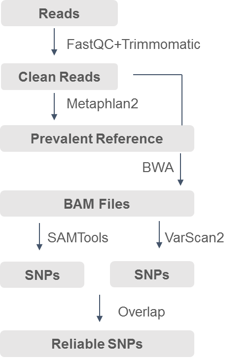

# metagenomic_SNP_calling
## Overview
This framework contains quality control, construction of microbial reference genomes, SNP calling, filtration of strains and SNP density. 

### Quality control of reads

FastQC (http://www.bioinformatics.babraham.ac.uk/projects/fastqc/) was used to have an overview of raw data. After having a general understanding of quality, we implemented personalized quality control strategies by combining Trimmomatic with python programs in step1_qc/trimmomatic.py. Then quality control used the following criteria: (1) adaptors were removed; (2) low-quality bases (<Q20) were trimmed; (3) reads containing less than 45 bases were removed. Parameters are ‘TRAILING:20 SLIDING- WINDOW:5:10 MINLEN:45 AVGQUAL:20’. (4) sites whose base call number (f) was beyond f ± 2 × SD (standard deviation) were cut. 

### Construction of microbial reference genome

With a large number of microbial reference genomes already in hand, it would cost vast computing resources and considerable time if we integrate all microbial reference genomes available as our reference genome. Considering long-tail distribution of abundances in microbiome analysis, only strains detected in more than 3 samples were reserved as the final reference genome. MetaPhlAn2 was used to profile the microorganisms and their relative abundances in each sample (see step2/metaphlan.py). The final reference genomes achieved by steps in folder step3_getRef are used in subsequent analysis.

### SNP calling 
According to the research of Altmann et al (A beginners guide to SNP calling from high-throughput DNA-sequencing data. Hum Genet 2012; 131:1541–54.), the SNP calling results using SAMTools have around 85 percent in common with that using GATK. Taking accuracy and run time into account, SAMTools was chosen as one of the softwares calling SNPs. The alignment of duplicates by BWA was first marked and filtered by Picard (http://broadinstitute.github.io/picard/). Then SAMTools was used to call SNPs with parameters ‘- vmO z -V indels’ and the results were filtered by VCFTools with parameters ‘+/d=10/a=4/Q=15/q=10/’. To reduce SNP false positives, VarScan2 was also used to call SNPs with ‘-min-coverage 10 -min-reads2 4 -min-var-freq 0.2 -p-value 0.05’. SNPs detected by both SAMTools and VarScan2 were selected for the next step of analysis (see details in step4_callSNP).

### Filtration of strains
Burrows-Wheeler Aligner-maximal exact match (BWA-MEM) was chosen to align clean reads to the constructed microbial reference genome in default settings. Given multiple alignment problem, we retained only the unique matched reads to increase the accuracy of subsequent variant calling. While large quantities of strains and genes exists in gut microbiome, lots of them are with low abundance. To further investigate representative strains and genes, we set relevant filter criteria: Strains with sufficient reads (more than 40% coverage of the reference genome) and enough sequencing depth (more than 10X) in at least 20 samples in the two groups respectively were selected (see details in step5_species_coverage). 

### SNP density
For prevalent strains with sufficient genome coverage and depth, getSNP_majorFreq.py was used to achieve major SNPs in these strains. getSNPnum.py was used to count SNPs of each prevalent strain in each sample and cal_density.py was used to calculate SNP density based on SNPs and genome coverage of strains. Mann-Whitney test was used to analyze the difference of SNP densitiy between the liver cirrhosis and control group. R package qvalue (v2.10.0) was used to control False Discovery Rate.  (see details in step6_snpdensity).

## Citation

### Comprehensive Strain-level Analysis of the Gut Microbe Faecalibacterium Prausnitzii in Patients with Liver Cirrhosis

Yaowen Chen1*, Pu Liu1*, Runyan Liu1, Shuofeng Hu1, Zhen He1, Guohua Dong1, Chao Feng1, Sijing An1, Xiaomin Ying1#

### Gut metagenomes of type 2 diabetic patients have characteristic single-nucleotide polymorphism distribution in Bacteroides coprocola

Yaowen Chen1 , Zongcheng Li1 , Shuofeng Hu1 , Jian Zhang1 , Jiaqi Wu1 , Ningsheng Shao1 , Xiaochen Bo2 , Ming Ni2* and Xiaomin Ying1*

## Pre-requisites
This part requires FastQC, Trimmomatic, MetaPhlAn2.0, bowtie2, bwa, Samtools, picard, bcftools, VarScan2, vcftools installed. 

## Flowchart

### Usage Examples

To help better understand how this framework works, we use data in filefolder test to run this framwork. It should be noted that due to the large amount of data in researches and our small test data, the threshold standard is slightly different.

Considering reseaches often includes large samples, we suggest that a file contains sample names and their type is needed, which is list1.txt here.

step1_qc performs quality control with a file contains sample name, datadir and outdir needed. The input is raw data and the output is clean data in test/clean_data.

    python step1_qc/trimmomatic.py filepath/filename datadir outdir                             `

step2_metaphlan profiles the microorganisms and their relative abundances in each sample. The input is clean data and the output is the info of microorganisms and their relative abundances in test/metaphlan2. 

    python step2_metaphlan/metaphlan.py metaphlan_dir out_dir  fastq_dir 

step3_getRef constructs microbial reference genome by selecting strains that meet certain conditions. Then you need to download reference genome from NCBI according to GCFid and build index for Reffna. You can see details in test/ref.  

    python2 step1_stat.py test/metaphlan2 > species.txt  
    #select names of strains detected in more than 3 samples as input (speciesname.txt) for subsequent analysis.  
    python2 step2_getStrain.py test/metaphlan2 > mappedstrain.txt   
    python2 step3_getrefid.py > mappedGCF.txt   
    
step4_callSNP includes calling SNPs by Samtools and VarScan2 respectively and some filter processes.

    python step1_callSNP.py 1
    python step2_varscan.py 1
    python step3_filtervcf.py 1
    python step4_gen_newvcf.py 1

step5_species_coverage first calculates genome coverage and width of strains by step1.py and step2.py, then achieve prevalent strains according to the filteration criteria by step3.py.

    python2 step1_depth_of_coverage.py 1 
    python2 step2_connectContigs2genome.py 
    python2 step3_filter.py 
    
step6_snpdensity calculates SNP density of prevalent strains and uses Mann-Whitney test to screen out strains with differences in SNP density between the two groups for next strain_profiling analysis. 

    python2 step1_getSNP_majorFreq.py 1
    python2 step2_getSNPnum.py 
    python2 step3_cal_density.py
    Rscript step4_static.r
